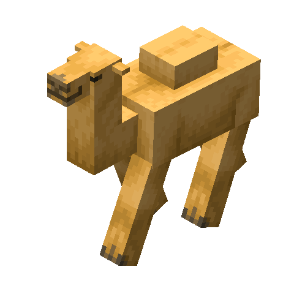

<p align="center">
  
</p>

<p align="center">
  
</p>

<p align="center">
  <strong>Plataforma web para administrar carreras, competidores, equipos, inscripciones, resultados, standings y trazabilidad de operaciones.</strong>
</p>

<p align="center">
  <a href="#descripcion">Descripcion</a>
  ·
  <a href="#funcionalidades-principales">Funcionalidades</a>
  ·
  <a href="#arquitectura">Arquitectura</a>
  ·
  <a href="#instalacion-y-ejecucion">Ejecucion</a>
  ·
  <a href="#datos-de-demostracion">Datos demo</a>
  ·
  <a href="#pruebas">Pruebas</a>
</p>

<p align="center">
  
</p>

## The Great EIA Camel vs. Dwarf Racing System

Camel Racing System es una aplicacion web orientada a la gestion integral de competencias de carreras. El sistema permite administrar competidores, equipos, carreras, inscripciones, resultados y standings, aplicando reglas de negocio, autenticacion, autorizacion por roles y audit log para mantener trazabilidad sobre las operaciones relevantes.

El proyecto fue desarrollado de forma individual como parte del proceso academico de Implementacion e Integracion de Software. La solucion combina una API REST, una interfaz web completa y una arquitectura de servicios locales levantados con Docker.

La identidad visual del frontend sigue la direccion **Dark Desert Shrine**: una mezcla entre registro antiguo de carreras, expedicion por el desierto y club de competencia misterioso, usando tonos de cobre, arena, madera, rojo profundo y oasis.

> **Nota de seguridad:** el proyecto utiliza Keycloak para autenticacion y autorizacion. Los archivos `.env` locales pueden contener configuracion especifica del entorno y no deben versionarse. El repositorio incluye plantillas de configuracion, pero no debe incluir secretos, tokens, cookies, contrasenas personales ni codigos de autenticacion.

## Video de demostracion

<p align="center">
  
</p>

<!--
Cuando el video este disponible, reemplaza el bloque anterior por uno como este:

<p align="center">
  <a href="AQUI_VA_EL_ENLACE_DEL_VIDEO" target="_blank" rel="noopener noreferrer">
    
  </a>
</p>
-->

<p align="center">
  
</p>

## Descripcion

La aplicacion gestiona el ciclo de vida de una competencia de carreras:

```text
Competidores y equipos
        |
        v
Creacion de carreras
        |
        v
Inscripciones individuales, por equipos o mixtas
        |
        v
Aprobacion, posicion de salida y validaciones
        |
        v
Carrera en progreso
        |
        v
Registro de resultados y ranking automatico
        |
        v
Standings de competidores y equipos
        |
        v
Audit Log de acciones relevantes
```

El sistema maneja tres modalidades de carrera:

| Modalidad | Descripcion |
|---|---|
| `INDIVIDUAL` | Participan competidores individuales |
| `TEAM` | Participan equipos activos con integrantes activos |
| `MIXED` | Permite competidores individuales y equipos en la misma carrera |

Tambien maneja los siguientes estados para el ciclo de vida de una carrera:

```text
DRAFT
OPEN_FOR_REGISTRATION
REGISTRATION_CLOSED
IN_PROGRESS
COMPLETED
CANCELLED
```

## Funcionalidades principales

### Competidores

- Crear, consultar, editar y listar competidores
- Buscar, filtrar, ordenar y paginar resultados
- Cambiar el estado de un competidor
- Retirar competidores
- Consultar estadisticas asociadas a carreras finalizadas
- Validar que solo competidores activos puedan participar individualmente

### Equipos

- Crear, consultar, editar y listar equipos
- Gestionar descripcion, entrenador, estado y estadisticas
- Agregar y retirar integrantes
- Validar que un competidor no pertenezca a mas de un equipo activo
- Validar que solo equipos activos con integrantes activos puedan participar en carreras de equipo o mixtas
- Desactivar equipos de forma controlada

### Carreras

- Crear, consultar, editar y listar carreras
- Filtrar por estado, modalidad y texto de busqueda
- Ordenar y paginar listados
- Gestionar ubicacion de salida, llegada, fecha programada, fecha limite de registro, distancia y capacidad
- Cambiar estados segun las transiciones permitidas
- Cancelar carreras
- Restringir la administracion de carreras al administrador o al organizador propietario

### Inscripciones

- Registrar competidores individuales en carreras `INDIVIDUAL` y `MIXED`
- Registrar equipos en carreras `TEAM` y `MIXED`
- Aprobar inscripciones asignando posicion de salida
- Rechazar inscripciones indicando el motivo
- Cancelar inscripciones pendientes o aprobadas
- Validar cupos y posiciones de salida durante la aprobacion
- Evitar registros duplicados
- Evitar que un competidor participe individualmente y mediante un equipo activo en la misma carrera

### Resultados y ranking

- Consultar resultados oficiales de cada carrera
- Registrar y actualizar resultados de participantes aprobados
- Manejar estados `FINISHED`, `DISQUALIFIED`, `DID_NOT_FINISH` y `DID_NOT_START`
- Calcular automaticamente las posiciones finales segun el tiempo efectivo y las reglas de ranking implementadas
- Actualizar estadisticas de victorias, derrotas y carreras completadas
- Validar que una carrera solo pueda completarse si tiene un ganador oficial

### Standings

- Mostrar standings de competidores
- Mostrar standings de equipos
- Actualizar la clasificacion a partir de los resultados registrados
- Consultar standings desde la pagina principal de la aplicacion

### Audit Log

- Registrar eventos relevantes de negocio
- Consultar acciones recientes desde Administration
- Mostrar usuario, accion, entidad, valores anteriores, valores nuevos y fecha
- Restringir la consulta de auditoria al rol `ADMINISTRATOR`

<p align="center">
  
</p>

## Arquitectura

```text
                         +----------------------+
                         |      Frontend        |
                         | React + TypeScript   |
                         | Vite build + Nginx   |
                         | http://localhost:5173|
                         +----------+-----------+
                                    |
                                    | HTTP + Bearer Token
                                    v
                         +----------------------+
                         |       Backend        |
                         | Spring Boot          |
                         | REST API             |
                         | http://localhost:8080|
                         +----+------------+----+
                              |            |
                              |            |
                              v            v
                 +----------------+   +----------------+
                 |   PostgreSQL   |   |    Keycloak    |
                 | localhost:5432|   | localhost:8180 |
                 +----------------+   +----------------+
```

El frontend se compila con Vite y se sirve desde Nginx dentro de un contenedor Docker. El navegador consume la API REST del backend y Keycloak mediante sus URLs publicas locales. El backend concentra las reglas de negocio, persiste la informacion en PostgreSQL y valida tokens JWT emitidos por Keycloak.

Docker Compose permite iniciar toda la solucion con un solo comando:

```powershell
docker compose up -d
```

### Tecnologias utilizadas

| Capa | Tecnologias |
|---|---|
| Frontend | React, TypeScript, Vite, Nginx, CSS |
| Backend | Java, Spring Boot, Spring Security, Spring Data JPA, Gradle |
| Base de datos | PostgreSQL |
| Identidad y acceso | Keycloak, OAuth 2.0, OpenID Connect, JWT |
| Contenedores | Docker, Docker Compose |
| Pruebas frontend | Vitest, Testing Library |
| Pruebas backend | JUnit, Mockito, Spring Test |
| Documentacion API | Swagger / OpenAPI |
| Verificacion local | PowerShell, Invoke-WebRequest |

<p align="center">
  
</p>

## Modelo de base de datos

El proyecto utiliza **PostgreSQL** como base de datos relacional. Las entidades principales se almacenan en tablas relacionadas mediante claves foraneas y UUIDs. Spring Data JPA se encarga del mapeo entre las entidades Java y el modelo relacional.

```text
User
 ├── 1:N Race
 ├── 1:N RaceRegistration
 ├── 1:N RaceResult
 └── 1:N AuditLog

Competitor
 ├── 1:N TeamMember
 └── 1:N RaceRegistration

Team
 ├── 1:N TeamMember
 └── 1:N RaceRegistration

Race
 └── 1:N RaceRegistration

RaceRegistration
 ├── 0..1 Competitor
 ├── 0..1 Team
 ├── N:1 Race
 └── 1:0..1 RaceResult

RaceResult
 └── 1:1 RaceRegistration

AuditLog
 └── N:1 User
```

La relacion central del modelo es `RaceRegistration`. Cada inscripcion representa exactamente un participante en una carrera:

- Un competidor individual
- O un equipo
- Nunca ambos al mismo tiempo

Los resultados se asocian a inscripciones aprobadas. Esto permite unificar resultados individuales y de equipos bajo el mismo flujo de carrera.

### Tablas principales

| Tabla | Responsabilidad |
|---|---|
| `users` | Usuarios locales sincronizados con la identidad autenticada |
| `competitors` | Participantes individuales y sus estadisticas |
| `teams` | Equipos, entrenador, estado y estadisticas |
| `team_members` | Relacion historica entre equipos y competidores |
| `races` | Configuracion, estado, fechas, ubicaciones y organizador de carreras |
| `race_registrations` | Participacion individual o por equipo en una carrera |
| `race_results` | Resultado oficial asociado a una inscripcion aprobada |
| `audit_logs` | Trazabilidad de acciones relevantes realizadas en el sistema |

<p align="center">
  
</p>

## Seguridad

La estrategia de seguridad esta basada en Keycloak y Spring Security.

- Keycloak centraliza autenticacion, usuarios y roles
- El frontend inicia sesion mediante OpenID Connect
- Keycloak emite tokens JWT para las solicitudes autenticadas
- El backend funciona como OAuth 2.0 Resource Server y valida los JWT antes de autorizar cada operacion
- Los roles se transforman a autoridades de Spring Security con prefijo `ROLE_`
- El backend es la autoridad final: las restricciones no dependen unicamente de lo que la interfaz oculte
- Swagger usa Authorization Code Flow con PKCE, por lo que no requiere exponer un client secret en el navegador
- Los secretos y configuraciones locales se mantienen fuera del control de versiones mediante archivos `.env`

### Roles y permisos

| Rol | Capacidades principales |
|---|---|
| `ADMINISTRATOR` | Puede administrar competidores, equipos, carreras, inscripciones y resultados de cualquier carrera. Tambien puede consultar Audit Log |
| `RACE_ORGANIZER` | Puede administrar solo las carreras de su propiedad, junto con sus inscripciones y resultados |
| `VIEWER` | Tiene acceso de solo lectura a la informacion permitida por el sistema |

La interfaz oculta controles no permitidos para mejorar la experiencia, pero las validaciones de autorizacion y ownership se aplican nuevamente en el backend.

### Usuarios de demostracion

Estas cuentas existen exclusivamente para desarrollo academico y demostracion local. No son credenciales personales y no deben reutilizarse fuera de este proyecto.

| Usuario | Contrasena | Rol |
|---|---|---|
| `admin` | `AdminCamel2026` | `ADMINISTRATOR` |
| `organizer` | `OrganizerCamel2026` | `RACE_ORGANIZER` |
| `viewer` | `ViewerCamel2026` | `VIEWER` |

El realm `camel-racing` se importa automaticamente cuando Keycloak inicia sobre un entorno de desarrollo vacio.

<p align="center">
  
</p>

## Estructura del repositorio

```text
camel-racing-system/
├── backend/
│   ├── src/
│   │   ├── main/
│   │   └── test/
│   ├── build.gradle
│   ├── gradlew.bat
│   ├── Dockerfile
│   └── README.md
├── frontend/
│   ├── public/
│   ├── src/
│   │   ├── api/
│   │   ├── app/
│   │   ├── auth/
│   │   ├── components/
│   │   ├── features/
│   │   ├── pages/
│   │   └── styles/
│   ├── .env.example
│   ├── package.json
│   ├── vite.config.ts
│   ├── Dockerfile
│   ├── nginx.conf
│   └── README.md
├── keycloak/
│   ├── realm-camel-racing.json
│   └── README.md
├── compose.yml
├── .env.template
├── seed-dark-fantasy-demo.sql
└── README.md
```

## Requisitos previos

Antes de iniciar, verifica que tienes instalado:

| Herramienta | Recomendacion |
|---|---|
| Docker Desktop | Docker Engine en ejecucion |
| Docker Compose | Incluido con Docker Desktop |
| Node.js | Version LTS actual, solo para desarrollo local y pruebas |
| npm | Incluido con Node.js, solo para desarrollo local y pruebas |
| Java / JDK | Version compatible con el proyecto Gradle, solo para desarrollo local y pruebas |
| Git | Necesario si vas a clonar el repositorio |
| PowerShell | Recomendado para Windows |

Para ejecutar la solucion completa mediante Docker no es necesario iniciar manualmente el backend ni el frontend. Docker construye el backend con Java y el frontend con Node durante la creacion de las imagenes.

Clona el repositorio y ubicate en la raiz:

```powershell
git clone [https://github.com/navyri/camel-racing-system.git](https://github.com/navyri/camel-racing-system.git)
Set-Location .\camel-racing-system
```

## Variables de entorno

El proyecto usa archivos locales de entorno para separar configuracion y secretos del codigo fuente.

### Entorno principal

Crea el archivo local desde la plantilla:

```powershell
Copy-Item .env.template .env
```

El archivo `.env.template` incluye valores de desarrollo para:

```text
DB_NAME
DB_USERNAME
DB_PASSWORD
DB_PORT
BACKEND_PORT
FRONTEND_PORT
KEYCLOAK_PORT
KEYCLOAK_ADMIN_USERNAME
KEYCLOAK_ADMIN_PASSWORD
```

No publiques el archivo `.env` real ni su contenido si contiene secretos o configuracion privada.

### Entorno del frontend para desarrollo local

El contenedor frontend recibe la configuracion necesaria como build arguments desde `compose.yml`. Solo necesitas crear `frontend/.env` si deseas ejecutar Vite directamente fuera de Docker:

```powershell
Set-Location .\frontend
Copy-Item .env.example .env
```

Las variables esperadas son:

```text
VITE_API_BASE_URL=http://localhost:8080
VITE_KEYCLOAK_URL=http://localhost:8180
VITE_KEYCLOAK_REALM=camel-racing
VITE_KEYCLOAK_CLIENT_ID=camel-racing-frontend
```

Regresa a la raiz cuando termines:

```powershell
Set-Location ..
```

## URLs y puertos

| Componente | URL o puerto | Proposito |
|---|---|---|
| Frontend Nginx | `http://localhost:5173` | Interfaz web |
| Backend Spring Boot | `http://localhost:8080` | API REST |
| Swagger UI | `http://localhost:8080/swagger-ui/index.html` | Documentacion y pruebas de API |
| Health check backend | `http://localhost:8080/actuator/health` | Verificacion de disponibilidad del backend |
| Health check frontend | `http://localhost:5173/health` | Verificacion de disponibilidad del frontend |
| Keycloak | `http://localhost:8180` | Autenticacion, roles y consola administrativa |
| PostgreSQL | `localhost:5432` | Persistencia relacional |

## Instalacion y ejecucion

### 1. Configurar variables de entorno

Desde la raiz del repositorio:

```powershell
Copy-Item .env.template .env
```

No reemplaces el archivo si ya tienes un `.env` local funcional, a menos que quieras reiniciar tu configuracion.

### 2. Iniciar la solucion completa

Desde la raiz del repositorio:

```powershell
docker compose up -d
```

Docker Compose construye e inicia todos los componentes necesarios:

```text
camel-racing-db
camel-racing-keycloak
camel-racing-backend
camel-racing-frontend
```

La primera ejecucion puede tardar varios minutos porque Docker descarga imagenes, construye el backend, compila el frontend y crea los contenedores.

Si cambias el codigo o necesitas reconstruir imagenes, ejecuta:

```powershell
docker compose up -d --build
```

### 3. Verificar servicios

```powershell
docker compose ps
```

Verifica la salud del backend:

```powershell
Invoke-WebRequest -UseBasicParsing http://localhost:8080/actuator/health
```

Verifica la salud del frontend:

```powershell
Invoke-WebRequest -UseBasicParsing http://localhost:5173/health
```

Verifica la configuracion OIDC de Keycloak:

```powershell
Invoke-WebRequest -UseBasicParsing http://localhost:8180/realms/camel-racing/.well-known/openid-configuration
```

Abre la aplicacion en el navegador:

```text
http://localhost:5173
```

### 4. Desarrollo local del frontend

Para desarrollar con hot reload sin reconstruir la imagen Docker, puedes ejecutar Vite manualmente en otra terminal:

```powershell
Set-Location .\frontend
npm install
npm run dev
```

Antes de iniciar Vite manualmente, detiene el servicio frontend Docker para liberar el puerto `5173`:

```powershell
Set-Location ..
docker compose stop frontend
```

Cuando quieras regresar al contenedor:

```powershell
docker compose start frontend
```

### 5. Consultar logs

```powershell
docker compose logs -f backend
docker compose logs -f frontend
docker compose logs -f keycloak
```

Para identificar el nombre exacto del servicio de PostgreSQL antes de consultar sus logs:

```powershell
docker compose ps
```

Luego usa el nombre que aparezca en la salida:

```powershell
docker compose logs -f <nombre-del-servicio-postgresql>
```

### 6. Detener los servicios

Para detener los contenedores sin eliminar datos persistidos:

```powershell
docker compose down
```

> **Importante:** no uses `docker compose down -v` a menos que realmente quieras eliminar los volumenes persistentes de PostgreSQL y la configuracion de Keycloak.

<p align="center">
  
</p>

## Datos de demostracion

El repositorio incluye el archivo:

```text
seed-dark-fantasy-demo.sql
```

Este script carga una demostracion con tematica de fantasia oscura y videojuegos, inspirada en universos como Fatal Frame, Elden Ring Nightreign, Alice: Madness y Dark Souls.

La carga incluye:

| Entidad | Cantidad |
|---|---:|
| Competidores | 8 |
| Equipos | 3 |
| Integrantes de equipos | 6 |
| Carreras | 7 |
| Inscripciones | 13 |
| Resultados oficiales | 9 |

Entre las carreras se incluyen modalidades individuales, por equipos y mixtas, junto con estados `DRAFT`, `OPEN_FOR_REGISTRATION`, `IN_PROGRESS` y `COMPLETED`.

### Ejecutar el seed

El script requiere que las tablas de negocio esten vacias. Antes de ejecutarlo, confirma que no estas mezclando datos demo con informacion que necesites conservar.

Desde la raiz del repositorio:

```powershell
Get-Content .\seed-dark-fantasy-demo.sql | docker exec -i camel-racing-db psql -v ON_ERROR_STOP=1 -U camel_racing_user -d camel_racing_db
```

Si el seed termina correctamente, debe mostrar:

```text
COMMIT
```

El script valida condiciones previas y usa una transaccion. Si encuentra un error, la carga no debe quedar parcialmente aplicada.

> **Audit Log:** el seed inserta datos directamente en PostgreSQL para facilitar la preparacion de la demostracion. Por esta razon, no genera registros en `audit_logs`. Para llenar el Audit Log, realiza acciones desde la interfaz, por ejemplo aprobar, rechazar o cancelar una inscripcion, actualizar un resultado, cambiar el estado de un competidor o cancelar una carrera.

### Escenarios sugeridos para demo

| Escenario | Carrera o modulo | Que demuestra |
|---|---|---|
| Resultado individual finalizado | Himuro Lantern Sprint | Resultados, posiciones y standings individuales |
| Resultado por equipo finalizado | Ashen Dunes Relay | Equipos, resultados y standings de equipos |
| Carrera mixta activa | Wonderland Eclipse Circuit | Inscripciones mixtas, resultados y ranking |
| Registro abierto | Limveld Nightfall Cup | Crear, aprobar, rechazar y cancelar registros |
| Carrera borrador individual | Firelink Ember Trial | Ciclo inicial de una carrera |
| Carrera borrador de equipos | Ash Lake Covenant Run | Configuracion de modalidad `TEAM` |
| Audit Log | Administration | Trazabilidad de operaciones realizadas desde UI |

<p align="center">
  
</p>

## API REST y ejemplos de solicitudes

La documentacion interactiva completa esta disponible en Swagger cuando el backend esta en ejecucion:

```text
http://localhost:8080/swagger-ui/index.html
```

Los endpoints protegidos requieren autenticacion con un JWT emitido por Keycloak.

| Recurso | Ruta base |
|---|---|
| Competidores | `/api/competitors` |
| Equipos | `/api/teams` |
| Carreras | `/api/races` |
| Inscripciones | `/api/races/{raceId}/registrations` |
| Resultados | `/api/races/{raceId}/results` |
| Standings | `/api/standings` |
| Audit Log | `/api/audit-logs` |

### Consultar el estado del backend

```powershell
Invoke-WebRequest -UseBasicParsing http://localhost:8080/actuator/health
```

### Consultar competidores autenticado

Reemplaza `<JWT_DE_KEYCLOAK>` por un token valido obtenido mediante Keycloak:

```powershell
$headers = @{
  Authorization = "Bearer <JWT_DE_KEYCLOAK>"
}

Invoke-RestMethod `
  -Method Get `
  -Uri "http://localhost:8080/api/competitors?page=0&size=5" `
  -Headers $headers
```

### Crear un competidor como administrador

```powershell
$headers = @{
  Authorization = "Bearer <JWT_DE_KEYCLOAK>"
  "Content-Type" = "application/json"
}

$body = @{
  name = "Demo Rider"
  nickname = "Sand Runner"
  competitorType = "CAMEL"
  approximateAge = 24
  weightKg = 70
  heightCm = 175
  origin = "Desert Camp"
} | ConvertTo-Json

Invoke-RestMethod `
  -Method Post `
  -Uri "http://localhost:8080/api/competitors" `
  -Headers $headers `
  -Body $body
```

### Consultar standings autenticado

```powershell
Invoke-RestMethod `
  -Method Get `
  -Uri "http://localhost:8080/api/standings" `
  -Headers @{
    Authorization = "Bearer <JWT_DE_KEYCLOAK>"
  }
```

Para probar operaciones protegidas desde el navegador, abre Swagger, presiona **Authorize** e inicia sesion con uno de los usuarios de demostracion.

<p align="center">
  
</p>

## Pruebas

### Validacion del frontend

Desde la carpeta `frontend`:

```powershell
npm run lint
npx vitest run
npm run build
```

La ultima validacion registrada fue:

```text
48 test files passed
372 tests passed
Build successful
```

### Validacion del backend

Desde la carpeta `backend`:

```powershell
.\gradlew.bat test
```

Resultado esperado:

```text
BUILD SUCCESSFUL
```

### Verificacion local de servicios

PowerShell se utiliza para verificar la disponibilidad del backend, frontend y Keycloak:

```powershell
Invoke-WebRequest -UseBasicParsing http://localhost:8080/actuator/health
Invoke-WebRequest -UseBasicParsing http://localhost:5173/health
Invoke-WebRequest -UseBasicParsing http://localhost:8180/realms/camel-racing/.well-known/openid-configuration
```

Las operaciones funcionales principales se prueban desde el frontend React autenticado con Keycloak y, cuando es necesario, desde Swagger.

### Revision de formato Git

Desde la raiz del repositorio:

```powershell
git diff --check
```

Este comando ayuda a detectar errores de espacios en blanco antes de crear un commit.

<p align="center">
  
</p>

## Limitaciones conocidas

Actualmente no se conocen limitaciones funcionales bloqueantes dentro de los casos de uso implementados y validados para el proyecto.

De todas formas, deben tenerse en cuenta estas consideraciones operativas:

- El entorno esta diseñado para desarrollo y demostracion local, no para despliegue productivo
- Las cuentas demo de Keycloak son publicas dentro del contexto academico local y no deben reutilizarse fuera de este proyecto
- El seed de demostracion requiere una base de datos de negocio limpia
- El seed carga datos directamente en PostgreSQL y, por ello, no genera eventos de Audit Log
- El video de demostracion aun esta pendiente de agregar
- La configuracion de servicios depende de Docker Desktop y de los puertos locales 5173, 8080, 8180 y 5432

## Mejoras futuras

- Incorporar filtros avanzados para Audit Log por usuario, accion, entidad y rango de fechas
- Agregar exportacion de standings y reportes
- Construir un dashboard administrativo con accesos rapidos a las areas de gestion
- Agregar metricas, monitoreo y observabilidad para un despliegue productivo
- Incorporar una estrategia de control de concurrencia para escenarios de acciones simultaneas
- Optimizar consultas administrativas de Audit Log en escenarios con grandes volumenes de datos
- Agregar el video de demostracion y capturas reales del sistema al repositorio

## Documentacion complementaria

Para profundizar en cada capa del proyecto, consulta:

- [Frontend: React, TypeScript y Vite](./frontend/README.md)
- [Backend: Spring Boot, API REST y PostgreSQL](./backend/README.md)
- [Keycloak: realm, roles y usuarios de demostracion](./keycloak/README.md)
- [Plantilla de variables de entorno](./.env.template)
- [Datos de demostracion](./seed-dark-fantasy-demo.sql)

## Notas de operacion

- El rol `VIEWER` tiene acceso de consulta, pero no puede realizar operaciones de escritura
- El rol `RACE_ORGANIZER` solo puede administrar recursos asociados a sus propias carreras
- El rol `ADMINISTRATOR` puede gestionar todas las carreras y consultar Audit Log
- La interfaz muestra acciones segun el rol, pero el backend mantiene la validacion definitiva
- Para una demostracion completa, usa el seed y realiza algunas acciones desde la UI para generar evidencia en Audit Log
- Antes de usar datos demo nuevamente, limpia la base de forma consciente y valida que no vas a borrar informacion necesaria

<p align="center">
  
</p>