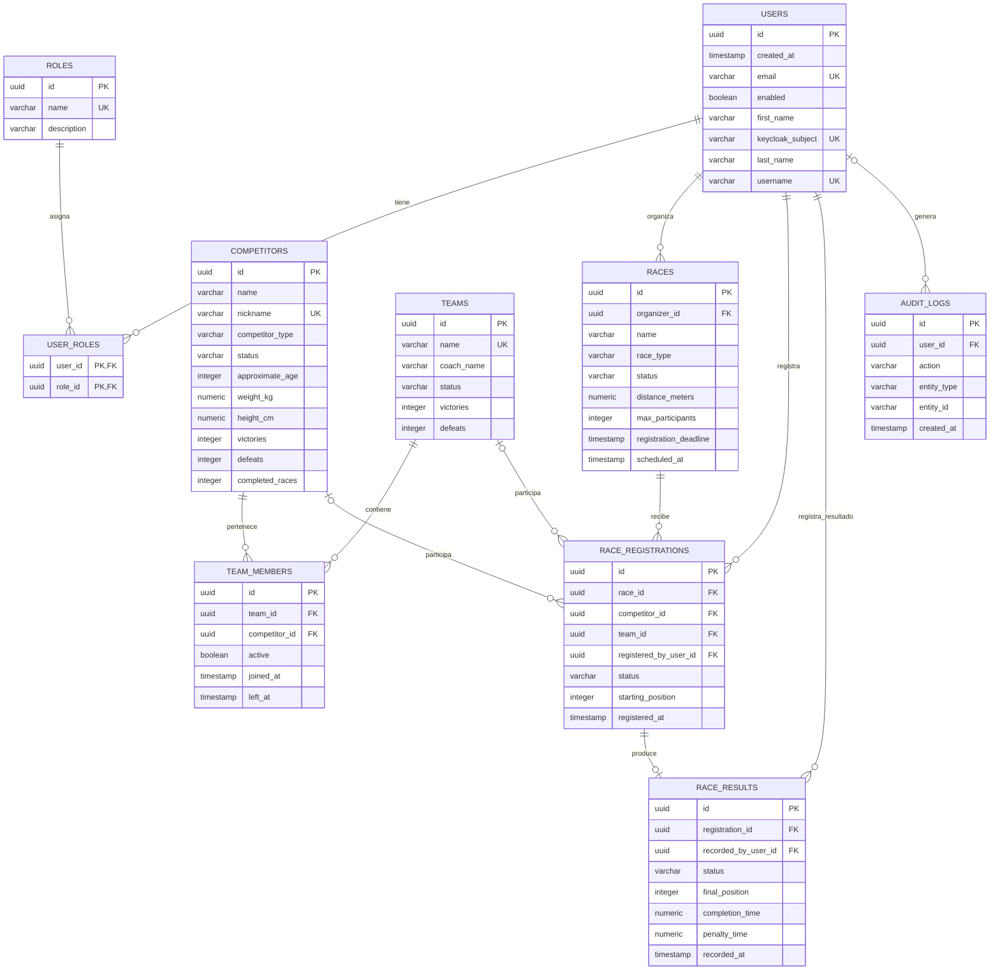
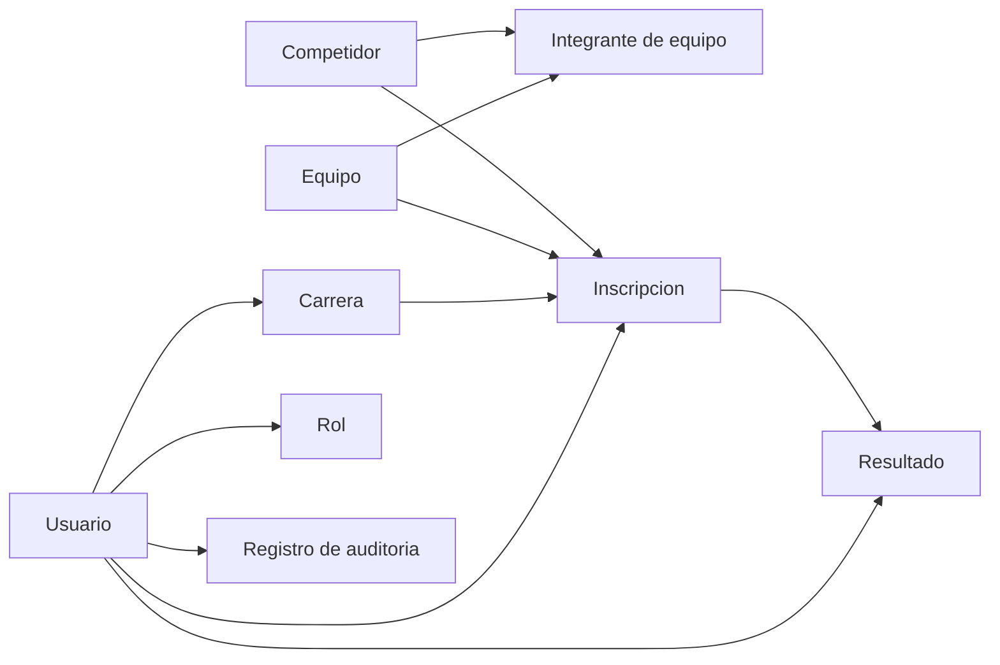

# Diagrama de Base de Datos

Este documento describe el modelo entidad-relacion de Camel Racing System.

## Diagrama Entidad-Relacion



## Tablas y convenciones

Los nombres de tablas, columnas y enumeraciones se mantienen en inglés porque corresponden a los nombres técnicos reales del esquema PostgreSQL y las entidades Java. Las explicaciones y reglas del modelo se documentan en español.

- `PK`: clave primaria.
- `FK`: clave foránea.
- `UK`: restricción de valor único.
- `o|`: relación opcional de cero o uno.
- `o{`: relación de cero o muchos.

## Reglas de negocio y restricciones

La base de datos aplica las siguientes reglas relevantes:

- `users.email`, `users.username` y `users.keycloak_subject` son valores únicos.
- `roles.name` es único y acepta únicamente `ADMINISTRATOR`, `RACE_ORGANIZER` o `VIEWER`.
- `user_roles` utiliza una clave primaria compuesta por `user_id` y `role_id`.
- `competitors.nickname` es único.
- `teams.name` es único.
- Un equipo no puede incluir dos veces al mismo competidor porque `team_members` tiene una restricción única sobre `(team_id, competitor_id)`.
- Una inscripción de carrera representa exactamente un participante:

```text
competitor_id XOR team_id
```

- `race_results.registration_id` es único; por tanto, una inscripción puede tener como máximo un resultado oficial.
- `audit_logs.user_id` es opcional, porque algunos eventos pueden no tener una referencia a un usuario local.

## Flujo principal



## Relacion central

La relación central del modelo es:

```text
Race -> RaceRegistration -> RaceResult
```

Una `RaceRegistration` representa la participación de un competidor individual o de un equipo dentro de una carrera. La regla `competitor_id XOR team_id` garantiza que una inscripción no represente ambos tipos de participante al mismo tiempo.

Los resultados se relacionan con una inscripción aprobada, lo que permite un flujo único para resultados individuales y por equipos.